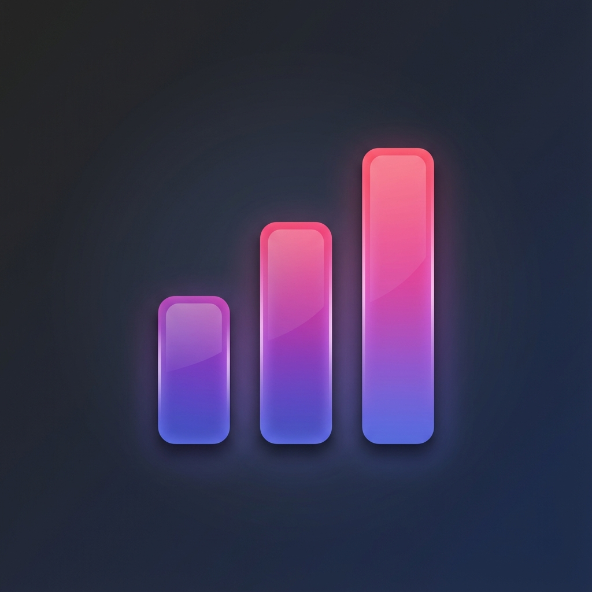
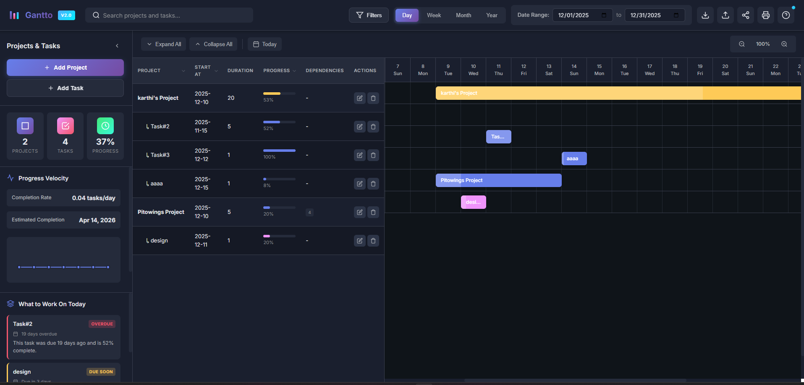

# Gantto - Professional Project Timeline Manager

A premium Chrome extension for creating and managing Gantt charts with advanced features including project/task management, date filtering, and print capabilities.

<!--  -->


## ✨ Features

### 🎯 Core Functionality
- **Project & Task Management**: Create hierarchical projects with multiple tasks
- **Interactive Gantt Chart**: Visual timeline with drag-and-drop capabilities
- **Date Range Filtering**: Filter timeline view with custom date ranges
- **Multiple View Modes**: Day, Week, Month, and Year views
- **Progress Tracking**: Track completion percentage for projects and tasks
- **Color Coding**: Assign custom colors to projects and tasks for easy identification

### 🎨 Premium Design
- **Modern Dark Theme**: Professional dark mode interface with vibrant gradients
- **Smooth Animations**: Micro-animations for enhanced user experience
- **Responsive Layout**: Optimized for various screen sizes
- **Glassmorphism Effects**: Modern UI with depth and visual hierarchy

### 🛠️ Advanced Features
- **Natural Language Task Creation**: Create tasks using conversational language (e.g., "Design homepage from Jan 15 for 2 weeks, 50% done")
- **Smart Templates & Learning**: Pre-built project templates and AI-powered insights from historical data
- **Critical Path Highlighting**: Identify and highlight the longest sequence of dependent tasks using CPM algorithm
- **Print Support**: Print-optimized Gantt charts for presentations
- **Data Persistence**: Automatic saving using Chrome storage
- **Real-time Updates**: Instant visual feedback on all changes
- **Today Indicator**: Highlighted current date in timeline
- **Progress Visualization**: Animated progress bars with shimmer effects

## 📦 Installation

### Method 1: Load Unpacked Extension (Development)

1. **Download or Clone** this repository to your local machine

2. **Open Chrome Extensions Page**:
   - Navigate to `chrome://extensions/`
   - Or click Menu (⋮) → More Tools → Extensions

3. **Enable Developer Mode**:
   - Toggle the "Developer mode" switch in the top-right corner

4. **Load the Extension**:
   - Click "Load unpacked"
   - Select the `gantt-chrart-pro` folder
   - The extension icon should appear in your Chrome toolbar

### Method 2: Package as CRX (Production)

1. Go to `chrome://extensions/`
2. Enable Developer mode
3. Click "Pack extension"
4. Select the extension directory
5. Click "Pack Extension"
6. Install the generated `.crx` file

## 📖 How to Use Gantto

<table>
<tr>
<td width="30%" valign="top">

### 📑 Quick Navigation

- [🚀 Getting Started](#-getting-started)
- [📊 Projects](#-projects)
- [✅ Tasks](#-tasks)
- [🗣️ Natural Language](#-natural-language)
- [📚 Templates](#-templates)
- [📈 Timeline Views](#-timeline-views)
- [🔍 Search & Filter](#-search--filter)
- [📤 Export & Share](#-export--share)
- [⌨️ Keyboard Shortcuts](#️-keyboard-shortcuts)
- [💡 Pro Tips](#-pro-tips)

</td>
<td width="70%" valign="top">

### 🚀 Getting Started

#### Opening Gantto
1. Click the **Gantto icon** in your Chrome toolbar
2. Application opens in fullscreen mode
3. You'll see a dark-themed professional interface

#### First Time Setup
- The app starts with an empty canvas
- Click **"Add Project"** to create your first project
- Or use **Templates** for quick start with pre-built projects

---

### 📊 Projects

#### Creating a Project

**Traditional Method:**
1. Click **"Add Project"** button (purple button in sidebar)
2. Fill in the form:
   - **Name**: Project title
   - **Start Date**: When project begins
   - **Duration**: Total days for project
   - **Color**: Visual identifier
   - **Description**: Optional notes
3. Click **"Save"**

**Using Natural Language:**
1. Click **"Add Project"**
2. Type: `"Website redesign from Jan 15 for 30 days"`
3. Click **"Parse & Fill Form"**
4. Review auto-filled fields
5. Click **"Save"**

#### Editing Projects
- Click the **pencil icon** (✏️) next to project name
- Modify any field except progress (auto-calculated)
- Save changes

#### Deleting Projects
- Click **trash icon** (🗑️) next to project
- Confirm deletion
- ⚠️ **Warning**: Deletes all tasks within the project

---

### ✅ Tasks

#### Adding Tasks

**Method 1: From Project (Recommended)**
1. Expand a project in the sidebar
2. Click **"Add Task"** button
3. Fill in task details
4. Task automatically linked to project

**Method 2: From Header**
1. Click **"Add Task"** in sidebar header
2. Select parent project from dropdown
3. Fill in details
4. Save

**Using Natural Language:**
1. Click **"Add Task"**
2. Type: `"Design mockups starting tomorrow for 5 days, 30% done"`
3. Click **"Parse & Fill Form"**
4. Review and save

#### Task Rules
✅ Start date must be within project dates  
✅ End date must be within project dates  
✅ All tasks must fit within project duration  
✅ Progress updates automatically reflect in project

#### Managing Tasks
- **Edit**: Click pencil icon
- **Delete**: Click trash icon
- **Progress**: Update anytime (0-100%)
- **Dependencies**: Link tasks together

---

### 🗣️ Natural Language

#### Quick Task Creation

**Supported Formats:**

| Format | Example |
|--------|---------|
| **Basic** | `Design homepage for 5 days` |
| **With Date** | `Backend API from 2025-01-15 for 2 weeks` |
| **With Progress** | `Testing phase for 3 days, 50% done` |
| **Relative Dates** | `Marketing campaign starting tomorrow for 10 days` |
| **Weekdays** | `Code review from next Monday for 2 days` |

#### Date Formats
- **Absolute**: `2025-01-15`, `01/15/2025`
- **Relative**: `today`, `tomorrow`, `next week`
- **Weekdays**: `next Monday`, `this Friday`
- **Offset**: `in 3 days`, `in 2 weeks`

#### Duration Formats
- `for 5 days`
- `for 2 weeks`
- `duration: 10 days`

#### Progress Formats
- `50% done`
- `30% complete`
- `75% progress`

---

### 📚 Templates

#### Using Built-in Templates

1. Click **Templates** button (layers icon) in header
2. Browse 6 professional templates:
   - 💻 Web Development (53 days)
   - 📢 Marketing Campaign (45 days)
   - 🚀 Product Launch (76 days)
   - ⚙️ Software Release (25 days)
   - 🎉 Event Planning (38 days)
   - ✍️ Content Creation (27 days)
3. Click **"Use Template"**
4. Project created with all tasks
5. Customize as needed

#### Creating Custom Templates

1. Build your projects with tasks
2. Open **Templates** modal
3. Go to **"My Templates"** tab
4. Click **"Save Current as Template"**
5. Enter template name
6. Template saved for reuse

#### Learning Insights

View AI-powered analytics:
- **Task Duration Patterns**: Average time for similar tasks
- **Completion Statistics**: Your success rate
- **Duration Insights**: Project timing analysis
- **Recommendations**: Personalized suggestions

---

### 📈 Timeline Views

#### View Modes

| Mode | Shows | Best For |
|------|-------|----------|
| **Day** | Individual days | Detailed planning |
| **Week** | Weekly blocks | Sprint planning |
| **Month** | Monthly overview | Long-term projects |
| **Year** | Annual view | Strategic planning |

#### Timeline Features
- **Color-coded bars**: Match project/task colors
- **Progress fill**: Lighter shade shows completion
- **Today marker**: Vertical line for current date
- **Hover details**: See info on hover

#### Date Range Control
1. Use date pickers in header
2. Set **Start Date** and **End Date**
3. Timeline adjusts automatically
4. Click **"Today"** to jump to current date

---

### 🔍 Search & Filter

#### Search
1. Use search box in sidebar
2. Type project or task name
3. Real-time filtering
4. Click **X** to clear

#### Filter by Progress
1. Click **filter icon** in sidebar
2. Select categories:
   - ⚪ Not Started (0%)
   - 🔵 In Progress (1-99%)
   - ✅ Completed (100%)
3. Apply filters
4. Clear to see all

#### Expand/Collapse
- **Expand All**: Show all tasks
- **Collapse All**: Hide all tasks
- **Individual**: Click project to toggle

---

### 📤 Export & Share

#### Export Data

**JSON Export:**
1. Click **"Export"** button
2. Select **"Export as JSON"**
3. Full data with all details
4. Use for backup or migration

**CSV Export:**
1. Click **"Export"** button
2. Select **"Export as CSV"**
3. Spreadsheet-compatible format
4. Open in Excel/Sheets

#### Share Your Chart

**Copy JSON:**
1. Click **"Share"** button
2. Select **"Copy JSON to Clipboard"**
3. Share data with others

**Generate Link:**
1. Click **"Share"** button
2. Select **"Generate Share Link"**
3. Copy the URL
4. Anyone with link can import

#### Print
1. Click **Print** icon (🖨️)
2. Browser print dialog opens
3. Chart optimized for printing
4. Adjust print settings
5. Print or save as PDF

---

### ⌨️ Keyboard Shortcuts

| Shortcut | Action |
|----------|--------|
| `Ctrl/Cmd + N` | New Project |
| `Ctrl/Cmd + T` | New Task |
| `Ctrl/Cmd + F` | Focus Search |
| `Ctrl/Cmd + P` | Print |
| `Ctrl/Cmd + E` | Export |
| `Escape` | Close Modal |
| `?` | Show Help |

---

### 💡 Pro Tips

#### Best Practices
✅ **Use Templates**: Start projects faster  
✅ **Natural Language**: Quick task creation  
✅ **Color Code**: Organize by priority/type  
✅ **Update Progress**: Keep data current  
✅ **Review Insights**: Learn from history  

#### Productivity Hacks
🚀 **Batch Create**: Use templates for similar projects  
🚀 **Smart Naming**: Use consistent task names for better insights  
🚀 **Dependencies**: Link related tasks  
🚀 **Regular Reviews**: Check progress weekly  
🚀 **Export Often**: Backup your data  

#### Common Workflows

**New Project Setup:**
```
1. Use template or create from scratch
2. Add all tasks upfront
3. Set realistic durations
4. Link dependencies
5. Track progress daily
```

**Sprint Planning:**
```
1. Create project for sprint
2. Add user stories as tasks
3. Use week view
4. Update daily
5. Review velocity
```

**Client Projects:**
```
1. Save client workflow as template
2. Use for each new client
3. Customize per project
4. Share progress via link
5. Export for invoicing
```

</td>
</tr>
</table>

---

## 🎯 Advanced Features

### Progress Velocity

- **Ctrl + N**: Create new project
- **Ctrl + F**: Focus search box

### Smart Suggestions

#### Task Dependencies
- Select dependent tasks when creating/editing
- Visual indicators show task relationships
- Helps manage complex project workflows

#### Progress Auto-Calculation
- Project progress = Average of all task progress
- Updates automatically when tasks change
- No manual project progress entry needed

#### Data Persistence
- All data saves automatically
- Stored locally in Chrome
- No internet connection required
- Data persists across sessions

---

## 🎨 Customization

### Color Schemes

The extension comes with preset color options:
- **Purple Gradient**: `#667eea` (Default)
- **Pink Gradient**: `#f093fb`
- **Blue Gradient**: `#4facfe`
- **Green Gradient**: `#43e97b`
- **Rose Gradient**: `#fa709a`
- **Yellow Gradient**: `#feca57`

You can also use the color picker to select any custom color.

### Modifying Styles

To customize the appearance:
1. Open `styles.css`
2. Modify CSS variables in the `:root` section:
   ```css
   :root {
     --primary-gradient: linear-gradient(135deg, #667eea 0%, #764ba2 100%);
     --bg-primary: #0f1419;
     --text-primary: #e4e6eb;
     /* ... more variables */
   }
   ```

## 📁 Project Structure

```
gantt-chrart-pro/
├── manifest.json          # Chrome extension configuration
├── popup.html            # Main HTML structure
├── styles.css            # Premium styling and animations
├── app.js                # Application logic and data management
├── icons/                # Extension icons
│   ├── icon16.png
│   ├── icon48.png
│   └── icon128.png
└── README.md             # This file
```

## 🔧 Technical Details

### Technologies Used
- **HTML5**: Semantic structure
- **CSS3**: Modern styling with gradients, animations, and flexbox
- **Vanilla JavaScript**: No dependencies, pure ES6+
- **Chrome Storage API**: Data persistence
- **Chrome Extension Manifest V3**: Latest extension format

### Browser Compatibility
- Chrome 88+
- Edge 88+ (Chromium-based)
- Other Chromium-based browsers

### Data Storage
- Uses `chrome.storage.local` API
- Data persists across browser sessions
- Automatic saving on all changes
- No external servers or databases required

## 🎯 Keyboard Shortcuts

Currently, the extension uses mouse/click interactions. Future versions may include:
- `Ctrl/Cmd + N`: New Project
- `Ctrl/Cmd + P`: Print
- `Escape`: Close Modal

## 🐛 Troubleshooting

### Extension Not Loading
- Ensure Developer Mode is enabled
- Check for errors in `chrome://extensions/`
- Verify all files are present in the directory

### Data Not Saving
- Check Chrome storage permissions in manifest.json
- Clear browser cache and reload extension
- Check browser console for errors

### Timeline Not Displaying
- Ensure date range is set correctly
- Verify projects have valid start dates
- Check that duration values are positive numbers

## 🚀 Future Enhancements

Planned features for future versions:
- [ ] Drag-and-drop timeline bars
- [ ] Export to PDF/PNG
- [ ] Import/Export JSON data
- [ ] Dependencies between tasks
- [ ] Resource allocation
- [ ] Multiple project views
- [ ] Collaboration features
- [ ] Dark/Light theme toggle
- [ ] Keyboard shortcuts
- [ ] Undo/Redo functionality

## 📄 License

This project is open source and available for personal and commercial use.

## 🤝 Contributing

Contributions are welcome! Feel free to:
- Report bugs
- Suggest new features
- Submit pull requests
- Improve documentation

## 📧 Support

For issues, questions, or suggestions, please create an issue in the repository.

---

## 👨‍💻 Author

### Karthikeyan T

**Full Stack Developer | Project Management Enthusiast**

I'm a passionate developer dedicated to creating tools that make project management easier and more efficient. Gantto was born from my own need for a simple, beautiful, and powerful Gantt chart tool that works right in the browser.

### 📬 Contact Information

- **Name**: Karthikeyan T
- **Email**: [tkarthikeyan@gmail.com](mailto:tkarthikeyan@gmail.com)
- **Phone**: +91 [Your Phone Number]
- **GitHub**: [@tkarthikeyan](https://github.com/tkarthikeyan)
- **Location**: India

### 🔗 Connect With Me

[](https://github.com/tkarthikeyan)
[](mailto:tkarthikeyan@gmail.com)

### 💼 About This Project

Gantto represents my commitment to:
- **Clean Code**: Well-structured, maintainable JavaScript
- **User Experience**: Intuitive interfaces that users love
- **Performance**: Fast, responsive applications
- **Design**: Beautiful, modern aesthetics

### 🌟 Other Projects

Check out my other work on [GitHub](https://github.com/tkarthikeyan) for more tools and applications.

### 🤝 Let's Collaborate

I'm always open to:
- **Feedback**: Share your thoughts on Gantto
- **Feature Requests**: Suggest improvements
- **Bug Reports**: Help make Gantto better
- **Contributions**: Submit pull requests
- **Collaboration**: Work together on new projects

Feel free to reach out via email or GitHub!

---

**Made with ❤️ by Karthikeyan T**

*Empowering project managers and developers with better tools*

Enjoy using Gantto! 🎉

---

### 📝 Version History

**v2.0** (Current)
- ✨ Added task validation against project duration
- ✨ Automatic project progress calculation from tasks
- ✨ Header "Add Task" button with project selector
- ✨ Smart suggestions and progress velocity
- ✨ Export and share functionality
- ✨ Comprehensive keyboard shortcuts
- ✨ Enhanced UI with guide modal

**v1.0**
- 🎉 Initial release
- ✅ Basic project and task management
- ✅ Gantt chart visualization
- ✅ Date filtering
- ✅ Print support

---

© 2024 Karthikeyan T. All rights reserved.
