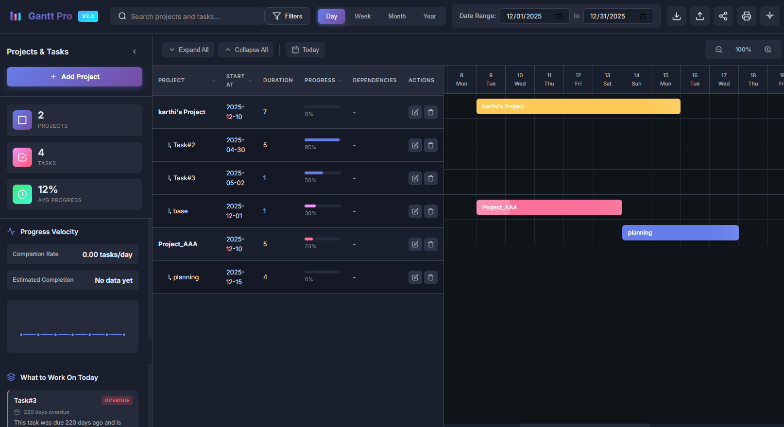

# Gantto - Professional Project Timeline Manager

A premium Chrome extension for creating and managing Gantt charts with advanced features including project/task management, date filtering, and print capabilities.

<!--  -->


## ✨ Features

### 🎯 Core Functionality
- **Project & Task Management**: Create hierarchical projects with multiple tasks
- **Interactive Gantt Chart**: Visual timeline with drag-and-drop capabilities
- **Date Range Filtering**: Filter timeline view with custom date ranges
- **Multiple View Modes**: Day, Week, Month, and Year views
- **Progress Tracking**: Track completion percentage for projects and tasks
- **Color Coding**: Assign custom colors to projects and tasks for easy identification

### 🎨 Premium Design
- **Modern Dark Theme**: Professional dark mode interface with vibrant gradients
- **Smooth Animations**: Micro-animations for enhanced user experience
- **Responsive Layout**: Optimized for various screen sizes
- **Glassmorphism Effects**: Modern UI with depth and visual hierarchy

### 🛠️ Advanced Features
- **Print Support**: Print-optimized Gantt charts for presentations
- **Data Persistence**: Automatic saving using Chrome storage
- **Real-time Updates**: Instant visual feedback on all changes
- **Today Indicator**: Highlighted current date in timeline
- **Progress Visualization**: Animated progress bars with shimmer effects

## 📦 Installation

### Method 1: Load Unpacked Extension (Development)

1. **Download or Clone** this repository to your local machine

2. **Open Chrome Extensions Page**:
   - Navigate to `chrome://extensions/`
   - Or click Menu (⋮) → More Tools → Extensions

3. **Enable Developer Mode**:
   - Toggle the "Developer mode" switch in the top-right corner

4. **Load the Extension**:
   - Click "Load unpacked"
   - Select the `gantt-chrart-pro` folder
   - The extension icon should appear in your Chrome toolbar

### Method 2: Package as CRX (Production)

1. Go to `chrome://extensions/`
2. Enable Developer mode
3. Click "Pack extension"
4. Select the extension directory
5. Click "Pack Extension"
6. Install the generated `.crx` file

## 🚀 Usage

### Getting Started

1. **Click the Extension Icon** in your Chrome toolbar to open Gantto

2. **Add Your First Project**:
   - Click the "Add Project" button in the sidebar
   - Fill in project details:
     - Name
     - Start Date
     - Duration (in days)
     - Progress (0-100%)
     - Color
   - Click "Save"

3. **Add Tasks to Projects**:
   - Click on a project in the sidebar to expand it
   - Click "Add Task" button
   - Fill in task details
   - Click "Save"

### Managing Projects & Tasks

#### Edit Items
- Click the edit icon (✏️) next to any project or task
- Modify the details in the modal
- Click "Save" to update

#### Delete Items
- Click the delete icon (🗑️) next to any project or task
- Confirm the deletion

#### View Timeline
- The Gantt chart automatically updates as you add/edit items
- Bars are color-coded to match their projects
- Progress is shown as a lighter shade within each bar

### Filtering by Date

1. **Set Date Range**:
   - Use the date pickers in the top-right header
   - Select "Start Date" and "End Date"
   - The timeline automatically updates to show only the selected range

2. **Change View Mode**:
   - Click Day/Week/Month/Year buttons to change timeline granularity
   - The timeline header adjusts accordingly

### Printing Charts

1. Click the **Print** icon (🖨️) in the header
2. Your browser's print dialog will open
3. The chart is automatically formatted for printing:
   - Sidebar and controls are hidden
   - Timeline is optimized for paper
   - Colors are preserved

## 🎨 Customization

### Color Schemes

The extension comes with preset color options:
- **Purple Gradient**: `#667eea` (Default)
- **Pink Gradient**: `#f093fb`
- **Blue Gradient**: `#4facfe`
- **Green Gradient**: `#43e97b`
- **Rose Gradient**: `#fa709a`
- **Yellow Gradient**: `#feca57`

You can also use the color picker to select any custom color.

### Modifying Styles

To customize the appearance:
1. Open `styles.css`
2. Modify CSS variables in the `:root` section:
   ```css
   :root {
     --primary-gradient: linear-gradient(135deg, #667eea 0%, #764ba2 100%);
     --bg-primary: #0f1419;
     --text-primary: #e4e6eb;
     /* ... more variables */
   }
   ```

## 📁 Project Structure

```
gantt-chrart-pro/
├── manifest.json          # Chrome extension configuration
├── popup.html            # Main HTML structure
├── styles.css            # Premium styling and animations
├── app.js                # Application logic and data management
├── icons/                # Extension icons
│   ├── icon16.png
│   ├── icon48.png
│   └── icon128.png
└── README.md             # This file
```

## 🔧 Technical Details

### Technologies Used
- **HTML5**: Semantic structure
- **CSS3**: Modern styling with gradients, animations, and flexbox
- **Vanilla JavaScript**: No dependencies, pure ES6+
- **Chrome Storage API**: Data persistence
- **Chrome Extension Manifest V3**: Latest extension format

### Browser Compatibility
- Chrome 88+
- Edge 88+ (Chromium-based)
- Other Chromium-based browsers

### Data Storage
- Uses `chrome.storage.local` API
- Data persists across browser sessions
- Automatic saving on all changes
- No external servers or databases required

## 🎯 Keyboard Shortcuts

Currently, the extension uses mouse/click interactions. Future versions may include:
- `Ctrl/Cmd + N`: New Project
- `Ctrl/Cmd + P`: Print
- `Escape`: Close Modal

## 🐛 Troubleshooting

### Extension Not Loading
- Ensure Developer Mode is enabled
- Check for errors in `chrome://extensions/`
- Verify all files are present in the directory

### Data Not Saving
- Check Chrome storage permissions in manifest.json
- Clear browser cache and reload extension
- Check browser console for errors

### Timeline Not Displaying
- Ensure date range is set correctly
- Verify projects have valid start dates
- Check that duration values are positive numbers

## 🚀 Future Enhancements

Planned features for future versions:
- [ ] Drag-and-drop timeline bars
- [ ] Export to PDF/PNG
- [ ] Import/Export JSON data
- [ ] Dependencies between tasks
- [ ] Resource allocation
- [ ] Multiple project views
- [ ] Collaboration features
- [ ] Dark/Light theme toggle
- [ ] Keyboard shortcuts
- [ ] Undo/Redo functionality

## 📄 License

This project is open source and available for personal and commercial use.

## 🤝 Contributing

Contributions are welcome! Feel free to:
- Report bugs
- Suggest new features
- Submit pull requests
- Improve documentation

## 📧 Support

For issues, questions, or suggestions, please create an issue in the repository.

---

**Made with ❤️ for project managers and developers**

Enjoy using Gantto! 🎉
